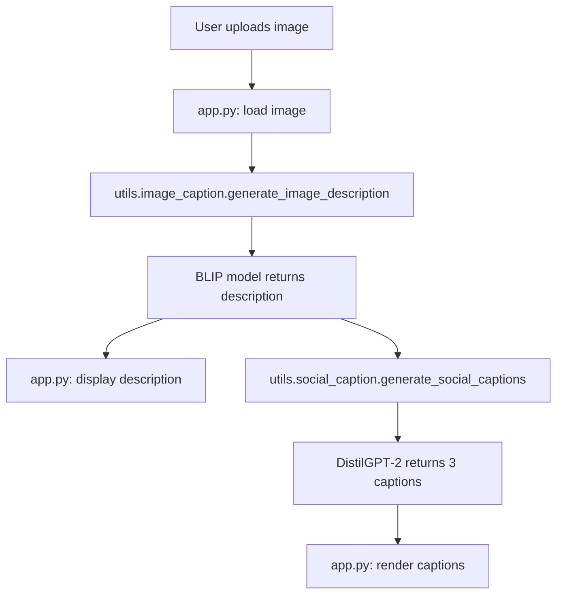

# Implementation Guide

## Overview
This document outlines the internal architecture of the **AI Image Caption Generator** project. It describes the purpose of each package/module, the data flow between components, and how the Streamlit UI orchestrates the inference pipeline.

## Package Structure
```
Image-Captioning-HuggingFace/
├── app.py                # Streamlit entry point & UI orchestration
├── requirements.txt      # Python dependencies
├── README.md             # User‑facing documentation
└── utils/
    ├── __init__.py       # (optional) makes utils a package
    ├── image_caption.py  # BLIP model loader & image‑to‑text function
    └── social_caption.py # DistilGPT‑2 loader & caption generation function
```

### `app.py`
- **Purpose**: Provides the web interface powered by Streamlit.
- **Key responsibilities**:
  1. Configure the page layout and sidebar description.
  2. Accept image uploads via `st.file_uploader`.
  3. Display the uploaded image preview.
  4. Invoke the two‑step inference pipeline:
     - Call `generate_image_description` (utils/image_caption).
     - Call `generate_social_captions` (utils/social_caption).
  5. Show the generated description and three captions using custom HTML cards.
  6. Handle all runtime errors gracefully, informing the user via `st.error`/`st.warning`.
- **Caching**: Relies on the `@st.cache_resource` decorators inside the utility modules to keep heavy models in memory across reruns, eliminating the expensive reload cost.

### `utils/image_caption.py`
- **Purpose**: Encapsulates the BLIP image‑captioning model.
- **Functions**:
  - `load_blip_models()`: Downloads (if needed) and returns the `BlipProcessor` and `BlipForConditionalGeneration` objects. Wrapped with `@st.cache_resource` to cache the models.
  - `generate_image_description(image: Image.Image) -> str`: Accepts a Pillow `Image`, runs the processor to produce input tensors, generates a caption, decodes it, and returns a clean string. Errors are converted into `RuntimeError` for upstream handling.
- **Workflow**: The function is pure; it does not perform any I/O beyond model inference, making it easy to test.

### `utils/social_caption.py`
- **Purpose**: Generates short social‑media‑ready captions from the BLIP description.
- **Functions**:
  - `load_text_generator()`: Creates a Hugging Face `pipeline` for `text‑generation` using the `distilgpt2` model. Cached with `@st.cache_resource`.
  - `_clean_lines(text: str) -> List[str]`: Helper to strip whitespace, dashes, and empty lines from the raw model output.
  - `generate_social_captions(description: str, num_captions: int = 3) -> List[str]`:
    * Builds a prompt that asks the language model for three short captions (no hashtags, no quotation marks).
    * Calls the text‑generation pipeline, parses the response, cleans it, and returns exactly `num_captions` items, falling back to simple templated captions if the model returns fewer.
- **Error handling**: Wraps any inference failure in a `RuntimeError` with a clear message.

## End‑to‑End Data Flow

1. **Upload** – Streamlit captures the file and converts it to a Pillow `Image`.
2. **Description** – The image is passed to `generate_image_description`, which returns a concise textual summary.
3. **Caption Generation** – The description string is fed to `generate_social_captions`, which prompts DistilGPT‑2 and extracts three cleaned captions.
4. **Presentation** – Both the description and captions are shown in the UI using custom HTML cards for a polished look.

## Caching Strategy
- Both heavy models (BLIP and DistilGPT‑2) are loaded once per session via `@st.cache_resource`.
- Subsequent user interactions reuse the cached objects, making the UI feel instantaneous after the first run.

## Extensibility
- **New models**: Replace the BLIP or DistilGPT‑2 model identifiers in the respective loader functions.
- **Additional captions**: Adjust the `num_captions` argument in `generate_social_captions` or modify the prompt template.
- **Custom UI**: Extend `app.py` with more Streamlit components (e.g., download buttons, theme customization) without touching the core inference logic.

---
*Prepared on 2026‑05‑17.*
